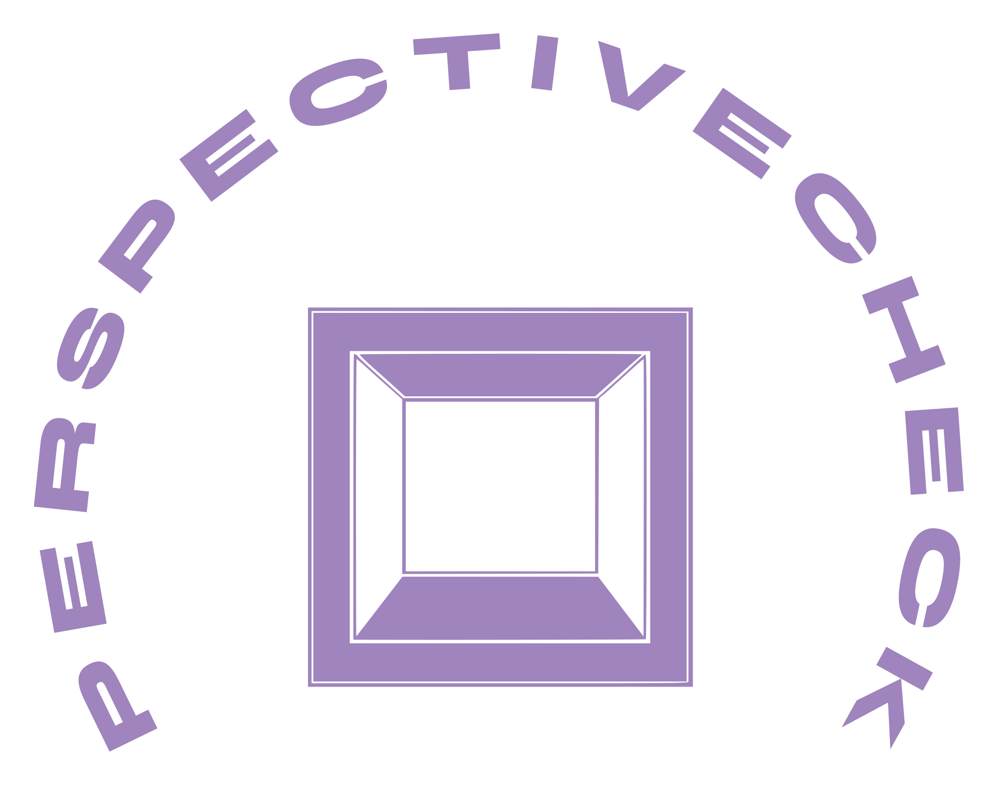

  

  <a href="https://perspectivecheck.samalbayati.com">Click to Try Now!</a>

# PerspectiveCheck

PerspectiveCheck is a web app for projecting 3D model geometry onto a 2D canvas.

Target 3D file support:

- OBJ (Supported)
- glTF and GLB (Supported)
- STL (Supported)
- 3MF
- FBX

## License

This project is source-available under the PolyForm Noncommercial
License 1.0.0.

You may use, modify, and distribute this software for permitted
noncommercial purposes.

Commercial use, including use by a business in its products,
services, internal operations, or client work, requires a separate
commercial license.

For commercial licensing, contact: sam.albayatii@gmail.com